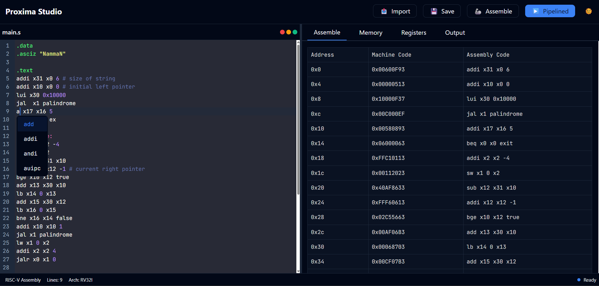
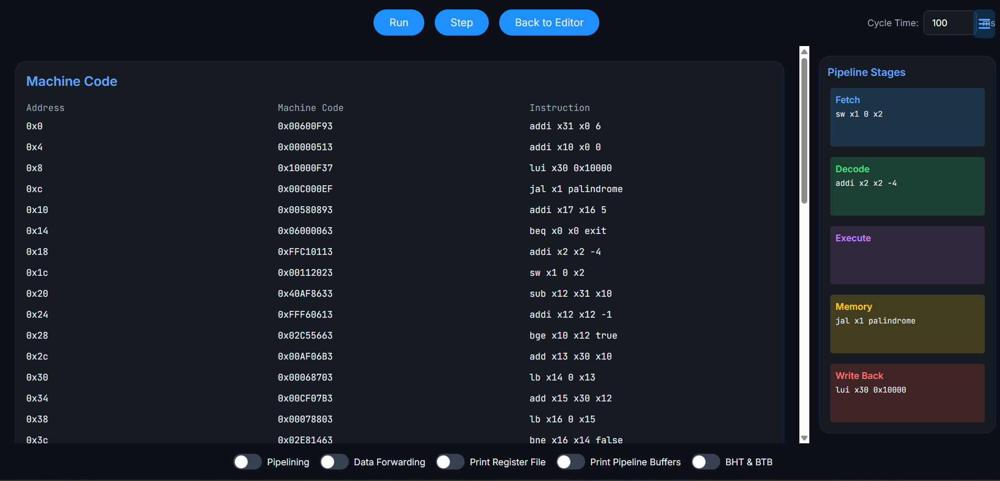

# 🛰️ Proxima Studio – RISC-V Assembly Editor & Pipeline Simulator

## Team Members
- **Harsh Rai** (2023CSB1345)  
- **Nishant Sahni** (2023CSB1140)  
- **Hardik Garg** (2023CSB1121)
## Overview
Proxima Studio is an educational tool for writing, assembling, and simulating RISC-V assembly programs. It combines a powerful text editor, assembler, and an interactive pipeline visualizer into a seamless interface built for learning low-level systems programming.

This project processes an assembly file (`input.asm`) using `main.cpp`. It generates two auxiliary files: `refined_code.asm` and `output.txt`, with the final output stored in `output.mc`. Additional test cases are available in the `inputs/` folder.

## UI/UX 
### Code Editor 


This is the heart of Proxima Studio’s user experience: a clean, responsive RISC-V assembly editor with syntax highlighting and inline auto-suggestions. On the left, users can seamlessly write or modify .s files, organizing .data and .text sections naturally. On the right, the real-time assembler displays memory-aligned machine code, decoded instructions, and instruction addresses in a synchronized table format. This immediate visual feedback empowers users to understand how their assembly maps to raw binary, bridging low-level code and hardware logic interactively.

### Pipeline Visualizer


Proxima Studio’s cycle-accurate RISC-V pipeline simulation in action. It vividly represents the classic 5-stage pipeline (Fetch, Decode, Execute, Memory, Write Back) with color-coded boxes that track each instruction as it flows through the processor. Users can observe instruction-level parallelism, identify hazards, and control execution step-by-step or in full-run mode. Additional toggles like pipelining, data forwarding, and register visibility enrich the debugging experience, making the learning process both intuitive and insightful.


## File Structure
```
.
├── inputs/             # Additional input cases
│   ├── input1.asm
│   ├── input2.asm
│   ├── input3.asm
│   ├── input4.asm
├── input.asm          # Main input file
├── main.cpp           # C++ program to process assembly file
├── output.mc          # Final processed output
├── output.txt         # Intermediate output file
├── refined_code.asm   # Refined assembly code
├── README.md          # Project documentation
```

## Usage
### Compilation
Compile the `main.cpp` file using g++:
```sh
g++ main.cpp -o merged.exe
```

### Running the Program
Run the compiled executable:
```sh
./merged.exe
```
By default, it takes `input.asm` and generates `refined_code.asm`, `output.txt`, and the final output `output.mc`.

## Additional Inputs
For additional test cases, place the respective `.asm` files inside the `inputs/` folder and modify the program to process them accordingly.

## Requirements
- C++ Compiler (g++)
- Assembly knowledge for modifying inputs

